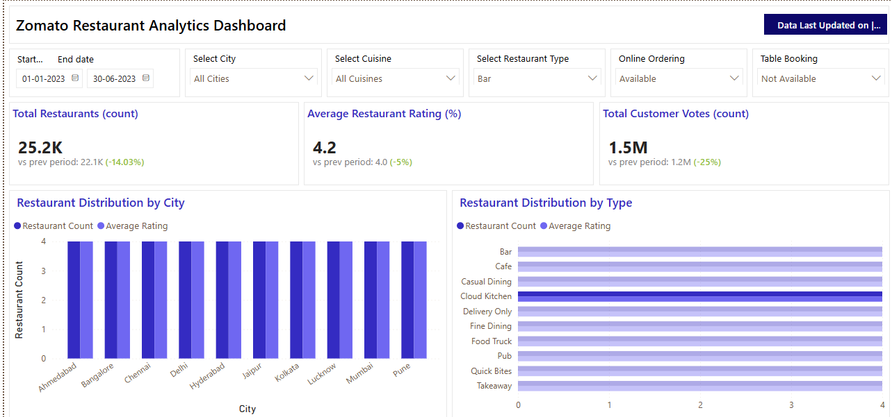

# Zomato Restaurant Data Analysis 🍽️📊

This project analyzes Zomato restaurant data to uncover customer behavior patterns, city-wise restaurant trends, pricing strategies, and cuisine preferences. The goal is to derive insights that can help restaurants improve customer engagement and business performance.

---

## 🎯 Project Objectives
- Identify key factors influencing restaurant ratings and customer satisfaction
- Compare restaurant performance across major Indian cities
- Analyze revenue and pricing trends across cuisine categories
- Build interactive dashboards for business decision support

---

## 🧰 Tools & Technologies Used
| Category | Tools |
|---------|-------|
| Programming | Python (Pandas, NumPy) |
| Dashboarding | **Power BI** |
| Visualization | Matplotlib, Seaborn |
| Data Source | Kaggle – Zomato Restaurant Dataset |
| Notebook | Jupyter Notebook |

---

## 🔄 Data Workflow
1. Data Cleaning (handling duplicates & missing values)
2. Standardizing city & cuisine labels
3. Exploratory Data Analysis (EDA)
4. KPI formulation (Rating, Review Count, Avg Cost, etc.)
5. Dashboard creation in Power BI for storytelling

---

## 📊 Key Insights
- Mid-range restaurants (₹200–₹350) show **higher customer retention**
- Cloud Kitchens show **rapid scaling capability**, driven by online orders
- Food Rating correlates more with **delivery time and service consistency** than pricing
- Tier-1 cities show more competition but stable rating behavior

---

## 🖥 Dashboard Previews

### Main KPIs & Distribution by City / Type

### Rating Trends, Cuisine Mix & Top Restaurants

---

## 📁 Project Structure
zomato-data-analysis/
│── Zomato project codes.ipynb # EDA + Preprocessing
│── Zomato restaurant dashboard.pbix # Power BI Dashboard
│── dashboard_preview.png # Screenshot 1
│── dashboard_insights.png # Screenshot 2
└── README.md # Project Documentation

## ✅ Conclusion
Consistent service quality and optimized pricing strategies have a strong positive impact on customer satisfaction and retention. The insights from this project can help restaurant owners make informed menu, pricing, and marketing decisions.
